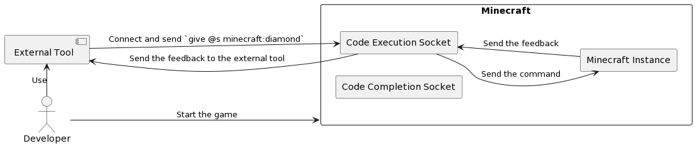
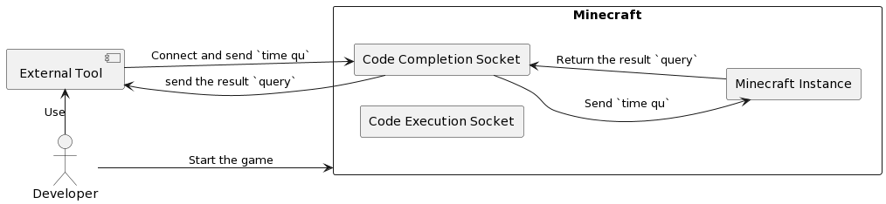
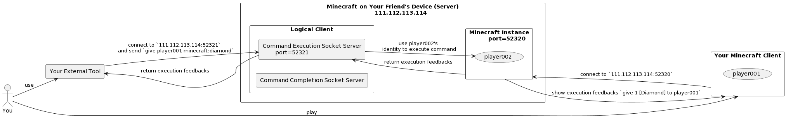
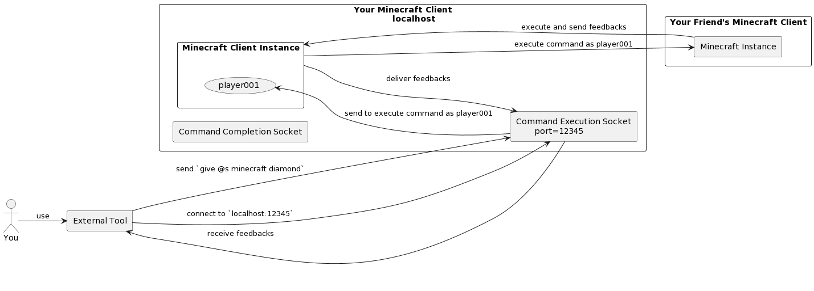

# Developer Documentation🛠️


## Categories📃

- [Overview](#overview)
- [Concepts](#concepts)
- [Working Principles](#working-principles)
    - [Abstract](#abstract)
    - [Single Player Game](#single-player-game)
    - [Multiplayer Game](#multiplayer-game)
- [Usage](#usage)
    - [Code Completion](#code-completion)
    - [Command Execution](#command-execution)
- [Examples](#examples)

## Overview️‍👁️‍🗨️

This is the developer documentation.
In this document, you will know how to develop external tools for the mods in this repository.
**It is unnecessary to clone this repository to develop external tools, just install the suitable mod from this
repository
in your Minecraft client.** The programing language is not limited, the only requirement is make your tool have the
ability
to connect to the socket server and interact with it.

## Concepts✨

- For 3.x version, the mod will create two socket servers, one for code completion and one for code execution, whatever
  the mod is for `Fabric` or `Quilt`.

  |      Server      |     Type      |                  Description                  |                                              Accepted Message                                               |   Returned Message   |
  |:----------------:|:-------------:|:---------------------------------------------:|:-----------------------------------------------------------------------------------------------------------:|:--------------------:|
  | Code Completion  | Socket Server |        The server for code completion         |                                  single line command or unfinished command                                  | multiple line result |
  |  Code Execution  | Socket Server | The server for command execution in Minecraft |                                             single line command                                             | execution feedbacks  |
  | Datapack Receive | Socket Server |  The server for receive datapack from client  | json string without `\n` like `{ "name": "[name].zip", "data": "[base64 encoded data]", "flag": "import" }` |         None         |

- In the 3.x version of the datapack management feature, you should send single line of json **WITHOUT** `\n` to invoke the datapack
  management service. <br>
  There are two types of datapack: `Common` and `Linked`, the `Common` datapacks are in line with the vanilla Minecraft, `Linked` datapacks modify game data in exactly the same way as `Common` datapacks, but is similar to temporary or virtual files that expire when the player exits the current world. <br>
  There are the fields of the json string:

  | Field  |  Type  |  Attribute   |                                                               Description                                                                |
  |:------:|:------:|:------------:|:----------------------------------------------------------------------------------------------------------------------------------------:|
  | `flag` | String | **REQUIRED** |                     The flag of the message, in {`delete`, `disable`, `enable`, `import`, `link`, `query`, `unlink`}                     |
  | `name` | String | **OPTIONAL** | Name of the datapack like `example.zip`, except the flag is `query` that you can ignore this field, otherwise this field is **REQUIRED** |
  | `data` | String | **OPTIONAL** |     The base64 encoded data of the datapack file, only `import` and `link` flag need this field, otherwise please ignore this field      |

  and these are the meanings of the flags:

  |   Flag    |                                                                         Description                                                                         |
  |:---------:|:-----------------------------------------------------------------------------------------------------------------------------------------------------------:|
  | `delete`  | Delete the datapack with the file name in the `name` field, and the mod will delete the file in `[YOUR_MINECRAFT_DIR]/saves/[CURRENT_WORLD_NAME]/datapacks` |
  | `disable` |                                                 Disable the datapack with the file name in the `name` field                                                 |
  | `enable`  |                                                 Enable the datapack with the file name in the `name` field                                                  |
  | `import`  |  Import the datapack with the file name (not path) in the `name` field, base64 encoded data in the `data` field should be the content of the datapack file  |
  |  `link`   |   Link the datapack with the file name (not path) in the `name` field, base64 encoded data in the `data` field should be the content of the datapack file   |
  |  `query`  |          Query the datapacks info, the `Datapack Management Service` socket server will return the json string of the datapacks info to the client          |
  |  `unlink` |                            Unlink the datapack with the file name in the `name` field, and the virtual datapack will be deleted                             |

  examples:

    - `{ "flag": "delete", "name": "demo0.zip"}`
    - `{ "flag": "disable", "name": "demo1.zip"}`
    - `{ "flag": "enable", "name": "demo2.zip"}`
    - `{ "flag": "import", "name": "demo3.zip", "data": "UEsDBAoAAAAAAOq5......" }`
    - `{ "flag": "link", "name": "demo4.zip", "data": "UEsDBAoAAAAAAOq5......" }`
    - `{ "flag": "query" }`
    - `{ "flag": "unlink", "name": "demo5.zip"}`

> Tips: the message sent is a single line of text, you should add `\n` at the end of the message or auto flush the
> buffer to send the message to the server.

## Working Principles📖

### Abstract

The mod `3.x` will create 3 socket servers, the first is code completion service socket, the second is for code execution, 
the third is datapack management service.
The socket server instances will be created when the game is loading, and the port of the socket server is random,
when you enter the world, the mod will print the port of the socket server in the game log, you can use this port to
connect to the socket server.
The mod can run both in the single player game and multiplayer game, but not multiplayer server, because the server will
not load the logical client of the mod.
> Tips: for security reasons, the event handler of the socket server was designed to run only in the logical client, to
> avoid SQL injection and other security problems. So the socket server will not work in the multiplayer server. But the
> only way to run the mod in multiplayer game is connect and play with your friends in the same LAN, because the owner
> of the game world has a logical client on his/her device, so the socket server will work in this situation.

### Single Player Game

In the single player game, the socket servers will be created in the logical client, so you can connect to the socket
server
at `localhost`. The port of the socket server will be printed in the game log when you enter the world.

- When you connect to the command execution socket server, you can send a single line command to the server, and the
  server
  will execute the command in the game, and return the execution feedbacks to you.

<div style="text-align: center">
  
  <p>Fig. 1 working principles of executing command in the single player game</p>
</div>

- When you connect to the command completion socket server, you can send a single line command or unfinished command to
  the
  server, and the server will return the multiple line result to you.

<div style="text-align: center">
  
  <p>Fig. 2 working principles of get command completion in the single player game</p>
</div>

### Multiplayer Game

In the multiplayer game, the socket servers will be created in the logical client of the physical server, so only
the players in the same LAN and play together can connect to the socket server in the game world owner's device. If
the logical client is not exist, the socket server will not work. There are two cases in the multiplayer game,
these are the two cases:

- **CASE 1**: You are playing in your friend's game world, and your friend is the owner of the game world, so the socket
  server is
  created in the logical client of your friend's device. In this case, you will use **YOUR FRIEND'S IDENTITY** to
  execute the
  command in the game, and the execution feedbacks will be returned to you.

<div style="text-align: center">
  
  <p>Fig. 3 working principles of executing command in the multiplayer game (1)</p>
</div>

- **CASE 2**: You are playing in your friend's game world, and you are connect to the socket server in your device,
  so you will use **YOUR IDENTITY** to execute the command in the game, and the execution feedbacks will be returned to
  you.

<div style="text-align: center">
  
  <p>Fig. 4 working principles of executing command in the multiplayer game (2)</p>
</div>

## Usage🎇

### Code Completion

1. Develop your external tool, which can connect to the socket server and interact with it.
2. Connect to the code completion socket server.
3. Send a single line command or unfinished command to the server one time.
4. The server will return the multiple line result to you.
5. You can use the result to complete your command outside the game.

### Command Execution

1. Develop your external tool, which can connect to the socket server and interact with it.
2. Connect to the command execution socket server.
3. Send a single line command to the server one time.
4. The server will execute the command in the game, and return the execution feedbacks to you.
5. You can see the execution feedbacks in your external tool.

## Examples📚

### Code Completion

- In this use case, we will show you how to use the code completion service.

   ```python
   # code_completion.py
   import socket
   
   s = socket.socket(socket.AF_INET, socket.SOCK_STREAM)
   s.connect(('localhost', int(input('port: '))))
   
   # send a message to the server
   s.send(b'give @s diamond\n')
   
   # receive the result from the server and print them line by line
   while True:
      data = s.recv(1024)
      if not data:
         break
      print(data.decode('utf-8'))
   s.close()
   ```

  Start your Minecraft game, and enter the world, then you will see the port of the code completion socket server in the
  game log,
  let's assume the code completion socket is `localhost:12345`.
  If your code is at `path/to/your/code_completion.py`, you can run it by `python path/to/your/code.py` in your
  terminal.
  Then you will get the result like this:

   ```console
   $ python "path/to/your/code_completion.py"
   port: 12345
   minecraft:deepslate_diamond_ore
   minecraft:diamond
   minecraft:diamond_axe
   minecraft:diamond_block
   minecraft:diamond_boots
   minecraft:diamond_chestplate
   minecraft:diamond_helmet
   minecraft:diamond_hoe
   minecraft:diamond_horse_armor
   minecraft:diamond_leggings
   minecraft:diamond_ore
   minecraft:diamond_pickaxe
   minecraft:diamond_shovel
   minecraft:diamond_sword
   ```

### Command Execution

- In this use case, we will show you how to use the code execution service.

   ```python
   # code_execution.py
   import socket
   
   s = socket.socket(socket.AF_INET, socket.SOCK_STREAM)
   s.connect(('localhost', int(input('port: '))))
   
   # send a message to the server
   s.send(b'give @s diamond\n')
   
   # receive the result from the server and print them line by line
   
   data = s.recv(4096)
   print(data.decode('utf-8'))
   
   s.close()
   ```

  Start your Minecraft game, and enter the world, then you will see the port of the code execution socket server in the
  game log,
  let's assume the code execution socket is `localhost:54321`.
  If your code is at `path/to/your/code_execution.py`, you can run it by `python path/to/your/code.py` in your terminal.
  Then you will get the result like this:

   ```console
   $ python "path/to/your/code_execution.py"
   port: 54321
   Gave 1 [Diamond] to <your name>
   ```
  And you will get a diamond in your inventory in the game.

### Datapack Management

```python
# datapack_receive.py
import socket
import json
import base64

s = socket.socket(socket.AF_INET, socket.SOCK_STREAM)
s.connect(('localhost', int(input('port: '))))

# open the datapack file
with open('path/to/your/datapack.zip', 'rb') as f:
    # read the file content
    data = f.read()
    # encode the file content with base64
    data = base64.b64encode(data)
    # decode the file content with utf-8
    data = data.decode('utf-8')
    # create the json string
    data = json.dumps({'name': 'your_datapack_name.zip', 'data': data, 'flag': 'import'})
    # send the json string to the server
    s.send(data.encode('utf-8'))
    s.send(b'\n')

s.close()
```

Start your Minecraft game, and enter the world, then you will see the port of the datapack receive socket server in the
game log, let's assume the datapack receive socket is `localhost:54321`.
If your code is at `datapack_receive.py`, you can run it by `python datapack_receive.py` in your
terminal.
Then you will get the result in the game log like this:

```console
Datapack `your_datapack_name.zip` received!
reloaded!
```