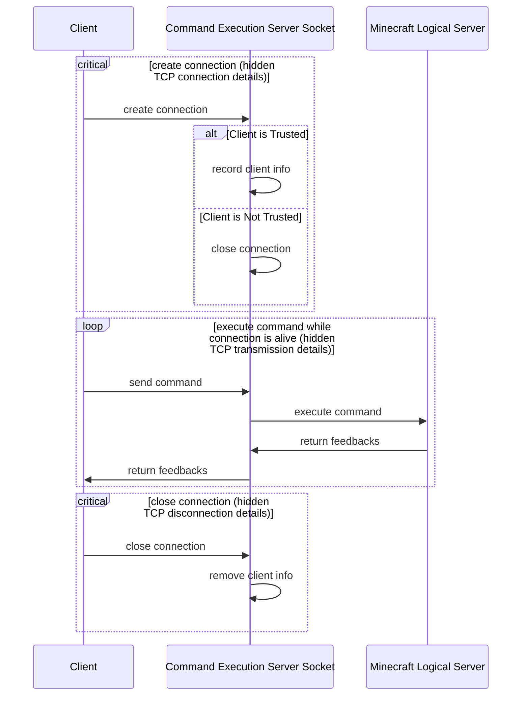
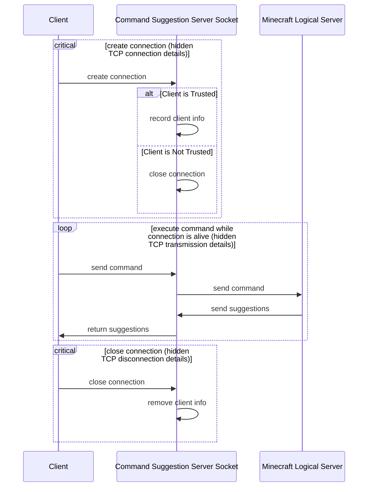
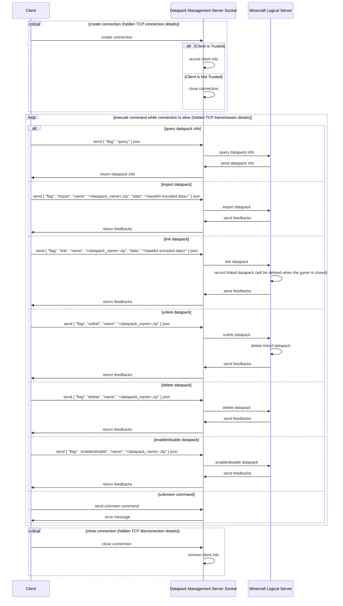
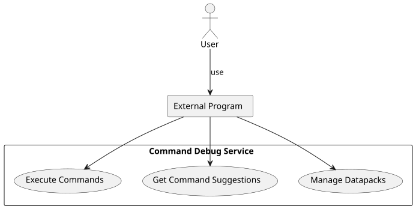

# Developer Documentation🛠️


## Categories📃

- [Overview](#overview)
- [Concepts](#concepts)
- [Working Principles](#working-principles)
    - [Abstract](#abstract)
    - [Single Player Game](#single-player-game)
    - [Multiplayer Game](#multiplayer-game)
- [Usage](#usage)
    - [Code Completion](#code-completion)
    - [Command Execution](#command-execution)
    - [Datapack Management](#datapack-management)
- [Examples](#examples)

## Overview️‍👁️‍🗨️

This is the developer documentation.
In this document, you will know how to develop external tools for the mods in this repository.
**It is unnecessary to clone this repository to develop external tools, just install the suitable mod from this
repository
in your Minecraft instance.** The programing language is not limited, the only requirement is make your tool have the
ability
to connect to the socket server and interact with it.

## Concepts✨

- For `4.x` version, the mod will create 3 socket servers, there are used for code completion, command execution and datapack management.

  |       Server        |     Type      |                  Description                  |                                              Accepted Message                                               |   Returned Message   |
  |:-------------------:|:-------------:|:---------------------------------------------:|:-----------------------------------------------------------------------------------------------------------:|:--------------------:|
  |   Code Completion   | Socket Server |        The server for code completion         |                                  single line command or unfinished command                                  | multiple line result |
  |   Code Execution    | Socket Server | The server for command execution in Minecraft |                                             single line command                                             | execution feedbacks  |
  | Datapack Management | Socket Server |  The server for receive datapack from client  | json string without `\n` like `{ "name": "[name].zip", "data": "[base64 encoded data]", "flag": "import" }` |         None         |

- In the `4.x` version of the datapack management feature, you should send single line of json **WITHOUT** `\n` to invoke the datapack
  management service. <br>
  There are two types of datapack: `Common` and `Linked`, the `Common` datapacks are in line with the vanilla Minecraft, `Linked` datapacks modify game data in exactly the same way as `Common` datapacks, but is similar to temporary or virtual files that expire when the player exits the current world. <br>
  There are the fields of the json string:

  | Field  |  Type  |  Attribute   |                                                               Description                                                                |
  |:------:|:------:|:------------:|:----------------------------------------------------------------------------------------------------------------------------------------:|
  | `flag` | String | **REQUIRED** |                     The flag of the message, in {`delete`, `disable`, `enable`, `import`, `link`, `query`, `unlink`}                     |
  | `name` | String | **OPTIONAL** | Name of the datapack like `example.zip`, except the flag is `query` that you can ignore this field, otherwise this field is **REQUIRED** |
  | `data` | String | **OPTIONAL** |     The base64 encoded data of the datapack file, only `import` and `link` flag need this field, otherwise please ignore this field      |

  and these are the meanings of the flags:

  |   Flag    |                                                                         Description                                                                         |
  |:---------:|:-----------------------------------------------------------------------------------------------------------------------------------------------------------:|
  | `delete`  | Delete the datapack with the file name in the `name` field, and the mod will delete the file in `[YOUR_MINECRAFT_DIR]/saves/[CURRENT_WORLD_NAME]/datapacks` |
  | `disable` |                                                 Disable the datapack with the file name in the `name` field                                                 |
  | `enable`  |                                                 Enable the datapack with the file name in the `name` field                                                  |
  | `import`  |  Import the datapack with the file name (not path) in the `name` field, base64 encoded data in the `data` field should be the content of the datapack file  |
  |  `link`   |   Link the datapack with the file name (not path) in the `name` field, base64 encoded data in the `data` field should be the content of the datapack file   |
  |  `query`  |          Query the datapacks info, the `Datapack Management Service` socket server will return the json string of the datapacks info to the client          |
  |  `unlink` |                            Unlink the datapack with the file name in the `name` field, and the virtual datapack will be deleted                             |

  examples:

    - `{ "flag": "delete", "name": "demo0.zip"}`
    - `{ "flag": "disable", "name": "demo1.zip"}`
    - `{ "flag": "enable", "name": "demo2.zip"}`
    - `{ "flag": "import", "name": "demo3.zip", "data": "UEsDBAoAAAAAAOq5......" }`
    - `{ "flag": "link", "name": "demo4.zip", "data": "UEsDBAoAAAAAAOq5......" }`
    - `{ "flag": "query" }`
    - `{ "flag": "unlink", "name": "demo5.zip"}`

> Tips: the message sent is a single line of text, you should add `\n` at the end of the message or auto flush the
> buffer to send the message to the server.

## Working Principles📖

### Abstract

The mod `4.x` will create 3 socket servers, the first is code completion service socket, the second is for code execution, 
the third is datapack management service.
The socket server instances will be created when the game is loading.

The mod `4.x` is rely on `MidnightLib` as the configuration library.

The mod can run both in the single player game and multiplayer game, but a logical server is always required.

### Command Execution Service

First, the client attempts to create a connection with the Command Execution Server Socket. If the client is trusted, the server socket records the client information; otherwise, it closes the connection. Once the connection is established, as long as the connection remains alive, the client can send commands to the server socket. The server socket then forwards these commands to the Minecraft Logical Server for execution. After the server executes the commands, it returns feedback to the server socket, which in turn sends the feedback back to the client. Finally, when the client decides to close the connection, the server socket removes the client information.


```mermaid
sequenceDiagram
    participant C as Client
    participant CESS as Command Execution Server Socket
    participant MC as Minecraft Logical Server
    critical create connection (hidden TCP connection details)
      C ->> CESS: create connection
      alt Client is Trusted
        CESS ->> CESS: record client info
      else Client is Not Trusted
        CESS ->> CESS: close connection
      end
    end

    loop execute command while connection is alive (hidden TCP transmission details)
        C ->> CESS: send command
        CESS ->> MC: execute command
        MC ->> CESS: return feedbacks
        CESS ->> C: return feedbacks
    end

    critical close connection (hidden TCP disconnection details)
      C ->> CESS: close connection
      CESS ->> CESS: remove client info
    end
```

### Command Suggestion Service

The client starts by creating a connection with the Command Suggestion Server Socket. If the client is verified as trusted, the server socket records the client's details; if not, the connection is terminated. During the period when the connection is active, the client sends commands to the server socket. The server socket then passes these commands to the Minecraft Logical Server. The server generates command suggestions and sends them back to the server socket, which then returns the suggestions to the client. When the client closes the connection, the server socket deletes the client information.


```mermaid
sequenceDiagram
    participant C as Client
    participant CSSS as Command Suggestion Server Socket
    participant MC as Minecraft Logical Server
    critical create connection (hidden TCP connection details)
      C ->> CSSS: create connection
      alt Client is Trusted
        CSSS ->> CSSS: record client info
      else Client is Not Trusted
        CSSS ->> CSSS: close connection
      end
    end
    loop execute command while connection is alive (hidden TCP transmission details)
        C ->> CSSS: send command
        CSSS ->> MC: send command
        MC ->> CSSS: send suggestions
        CSSS ->> C: return suggestions
    end
    critical close connection (hidden TCP disconnection details)
      C ->> CSSS: close connection
      CSSS ->> CSSS: remove client info
    end
```

### Datapack Management Service

The client initiates the process by creating a connection with the Datapack Management Server Socket. Based on whether the client is trusted, the server socket either records the client information or closes the connection. While the connection is open, the client can send different types of JSON - formatted commands. These commands can be used to query datapack information, import, link, unlink, delete, or enable/disable a datapack. For each type of valid command, the server socket forwards the request to the Minecraft Logical Server. The server processes the request and sends feedback to the server socket, which then returns the feedback to the client. If an unknown command is sent, the server socket sends an error message to the client. When the client closes the connection, the server socket removes the client's recorded information.


```mermaid
sequenceDiagram
    participant C as Client
    participant DMS as Datapack Management Server Socket
    participant MC as Minecraft Logical Server
    critical create connection (hidden TCP connection details)
      C ->> DMS: create connection
      alt Client is Trusted
        DMS ->> DMS: record client info
      else Client is Not Trusted
        DMS ->> DMS: close connection
      end
    end
    loop execute command while connection is alive (hidden TCP transmission details)
        alt query datapack info
            C ->> DMS: send { "flag": "query" } json
            DMS ->> MC: query datapack info
            MC ->> DMS: send datapack info 
            DMS ->> C: return datapack info
        else import datapack
            C ->> DMS: send { "flag": "import", "name": "<datapack_name>.zip", "data": "<base64 encoded data>" } json
            DMS ->> MC: import datapack
            MC ->> DMS: send feedbacks
            DMS ->> C: return feedbacks
        else link datapack
            C ->> DMS: send { "flag": "link", "name": "<datapack_name>.zip", "data": "<base64 encoded data>" } json
            DMS ->> MC: link datapack
            MC ->> MC: record linked datapack (will be deleted when the game is closed)
            MC ->> DMS: send feedbacks
            DMS ->> C: return feedbacks
        else unlink datapack
            C ->> DMS: send { "flag": "unlink", "name": "<datapack_name>.zip" } json
            DMS ->> MC: unlink datapack
            MC ->> MC: delete linked datapack
            MC ->> DMS: send feedbacks
            DMS ->> C: return feedbacks
        else delete datapack
            C ->> DMS: send { "flag": "delete", "name": "<datapack_name>.zip" } json
            DMS ->> MC: delete datapack
            MC ->> DMS: send feedbacks
            DMS ->> C: return feedbacks
        else enable/disable datapack
            C ->> DMS: send { "flag": "enable/disable", "name": "<datapack_name>.zip" } json
            DMS ->> MC: enable/disable datapack
            MC ->> DMS: send feedbacks
            DMS ->> C: return feedbacks
        else unknown command
            C ->> DMS: send unknown command
            DMS ->> C: error message
        end
    end
    critical close connection (hidden TCP disconnection details)
      C ->> DMS: close connection
      DMS ->> DMS: remove client info
    end
```

## Usage🎇



### Security Configuration

#### Ports

- **Command Execution Socket Port**: The port for the command execution service socket binding. The default value is `0`, which means the service will be disabled. If you modify this value, it will be applied when the program restarts.

#### Show Socket Info

Boolean value, if true, the server socket info will be shown in the message field for the trusted clients.

#### Trust Mode

The client socket trust mode for the Command Debug Service.
- **ALL_ALLOWED**: All clients are allowed to connect.
- **WHITE_LIST**: Only clients recorded in the `Trusted IPv4 Addresses` are allowed to connect.

#### Trusted IPv4 Addresses
The white list for the Command Debug Service. Only clients recorded in this list are allowed to connect in `WHITE_LIST` mode, otherwise, all clients are trusted.

> for more details, see [me.jaffe2718.cmdkit.util.SecurityConfig](fabric/src/main/java/me/jaffe2718/cmdkit/util/SecurityConfig.java)

### Code Completion

1. Develop your external tool, which can connect to the socket server and interact with it.
2. Connect to the code completion socket server.
3. Send a single line command or unfinished command to the server one time.
4. The server will return the multiple line result to you.
5. You can use the result to complete your command outside the game.

### Command Execution

1. Develop your external tool, which can connect to the socket server and interact with it.
2. Connect to the command execution socket server.
3. Send a single line command to the server one time.
4. The server will execute the command in the game, and return the execution feedbacks to you.
5. You can see the execution feedbacks in your external tool.

### Datapack Management
1. Develop your external tool, which can connect to the socket server and interact with it.
2. Connect to the datapack management socket server.
3. Send a single line json string to the server one time, see [Concepts](#concepts) for more details.

## Examples📚

### Code Completion

- In this use case, we will show you how to use the code completion service.

   ```python
   # code_completion.py
   import socket
   
   s = socket.socket(socket.AF_INET, socket.SOCK_STREAM)
   s.connect(('localhost', int(input('port: '))))
   
   # send a message to the server
   s.send(b'give @s diamond\n')
   
   # receive the result from the server and print them line by line
   while True:
      data = s.recv(1024)
      if not data:
         break
      print(data.decode('utf-8'))
   s.close()
   ```

  Start your Minecraft game, and enter the world, then you will see the port of the code completion socket server in the
  game log,
  let's assume the code completion socket is `localhost:12345`.
  If your code is at `path/to/your/code_completion.py`, you can run it by `python path/to/your/code.py` in your
  terminal.
  Then you will get the result like this:

   ```console
   $ python "path/to/your/code_completion.py"
   port: 12345
   minecraft:deepslate_diamond_ore
   minecraft:diamond
   minecraft:diamond_axe
   minecraft:diamond_block
   minecraft:diamond_boots
   minecraft:diamond_chestplate
   minecraft:diamond_helmet
   minecraft:diamond_hoe
   minecraft:diamond_horse_armor
   minecraft:diamond_leggings
   minecraft:diamond_ore
   minecraft:diamond_pickaxe
   minecraft:diamond_shovel
   minecraft:diamond_sword
   ```

### Command Execution

- In this use case, we will show you how to use the code execution service.

   ```python
   # code_execution.py
   import socket
   
   s = socket.socket(socket.AF_INET, socket.SOCK_STREAM)
   s.connect(('localhost', int(input('port: '))))
   
   # send a message to the server
   s.send(b'give @p[name=Jaffe2718] minecraft:diamond\n')
   
   # receive the result from the server and print them line by line
   
   data = s.recv(4096)
   print(data.decode('utf-8'))
   
   s.close()
   ```

  Start your Minecraft game, and enter the world, then you will see the port of the code execution socket server in the
  game log,
  let's assume the code execution socket is `localhost:54321`.
  If your code is at `path/to/your/code_execution.py`, you can run it by `python path/to/your/code.py` in your terminal.
  Then you will get the result like this:

   ```console
   $ python "path/to/your/code_execution.py"
   port: 54321
   Gave 1 [Diamond] to Jaffe2718
   ```
  And you will get a diamond in your inventory in the game.

### Datapack Management

```python
# datapack_receive.py
import socket
import json
import base64

s = socket.socket(socket.AF_INET, socket.SOCK_STREAM)
s.connect(('localhost', int(input('port: '))))

# open the datapack file
with open('path/to/your/datapack.zip', 'rb') as f:
    # read the file content
    data = f.read()
    # encode the file content with base64
    data = base64.b64encode(data)
    # decode the file content with utf-8
    data = data.decode('utf-8')
    # create the json string
    data = json.dumps({'name': 'your_datapack_name.zip', 'data': data, 'flag': 'import'})
    # send the json string to the server
    s.send(data.encode('utf-8'))
    s.send(b'\n')

s.close()
```

Start your Minecraft game, and enter the world, then you will see the port of the datapack receive socket server in the
game log, let's assume the datapack receive socket is `localhost:54321`.
If your code is at `datapack_receive.py`, you can run it by `python datapack_receive.py` in your
terminal.
Then you will get the result in the game log like this:

```console
Datapack `your_datapack_name.zip` received!
reloaded!
```