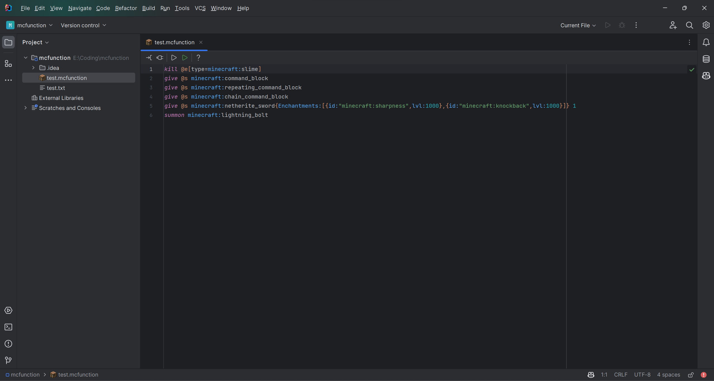
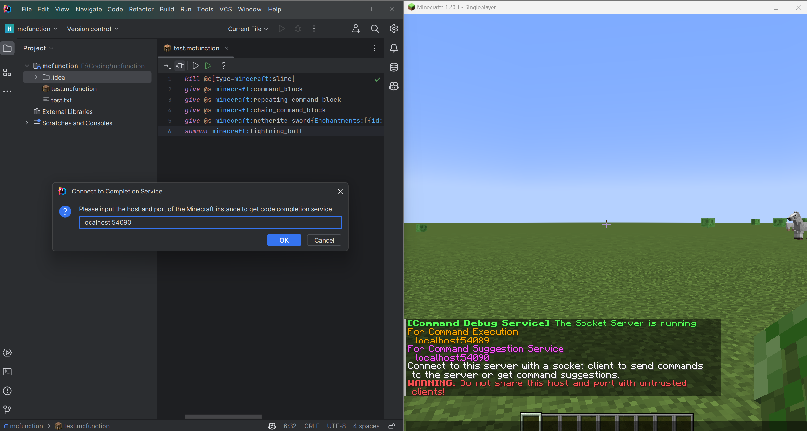
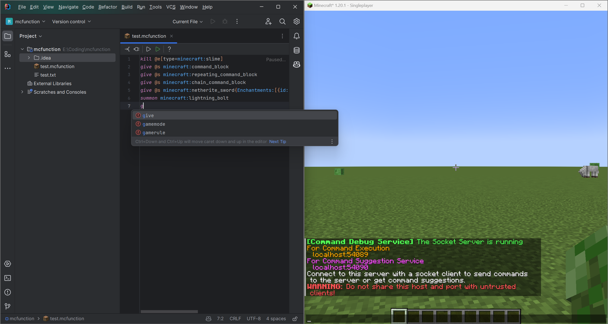
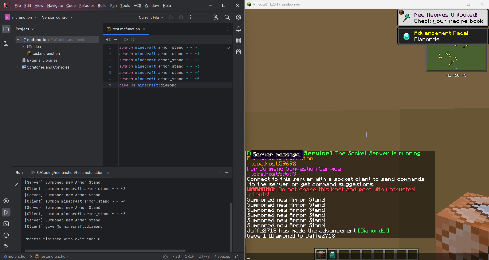

# Command Debug DevKit

by Jaffe2718

## Introduction
This project is written for debugging Minecraft commands. In this project, there are serveral subprojects:
- `fabric`: The mod for fabric, used to be a connection kit for IDE. It can create two socket server to provide code completion and code execution service.
- `ide-debug-tool`: This is a command line tool which can connect to the socket server opened by the mod. It can send code to the server and get the result. It can be a debug tool for IDE or a command line tool to execute *.mcfunction file directly.
- `idea-plugin`: This is a plugin for IntelliJ IDEA. It can connect to the socket server opened by the mod. It provides code completion and code execution service for IDE. The plugin contains a compiled `ide-debug-tool` so you don't need to install it manually.
- `quilt`: The mod for quilt, used to be a connection kit for IDE. It can create two socket server to provide code completion and code execution service.

## Setup

### Mods

 

#### Fabric/Quilt Mod
1. Install Minecraft with`Fabric/Quilt Loader` and 
[![Fabric-API](https://img.shields.io/badge/Fabric%20API-000000?logo=data%3Aimage%2Fsvg%2Bxml%3Bbase64%2CPHN2ZyB3aWR0aD0iMTYiIGhlaWdodD0iMTYiIHhtbG5zPSJodHRwOi8vd3d3LnczLm9yZy8yMDAwL3N2ZyIgcm9sZT0iaW1nIj4gPGc%2BICA8cmVjdCB4PSIxMSIgeT0iMiIgd2lkdGg9IjEiIGhlaWdodD0iOCIgZmlsbD0icmdiKDcsMCwwKSIvPiAgPHJlY3QgeD0iNCIgeT0iNSIgd2lkdGg9IjIiIGhlaWdodD0iMiIgZmlsbD0icmdiKDkzLDg1LDcwKSIvPiAgPHJlY3QgeD0iMTIiIHk9IjciIHdpZHRoPSIyIiBoZWlnaHQ9IjMiIGZpbGw9InJnYig0MiwzNiwyNCkiLz4gIDxyZWN0IHg9IjYiIHk9IjMiIHdpZHRoPSI3IiBoZWlnaHQ9IjQiIGZpbGw9InJnYigyMzQsMjE5LDE4OSkiLz4gIDxyZWN0IHg9IjgiIHk9IjAiIHdpZHRoPSIyIiBoZWlnaHQ9IjEiIGZpbGw9InJnYigyNCwxOCw4KSIvPiAgPHJlY3QgeD0iNyIgeT0iMSIgd2lkdGg9IjIiIGhlaWdodD0iMyIgZmlsbD0icmdiKDE0MiwxMzEsMTEyKSIvPiAgPHJlY3QgeD0iNyIgeT0iMSIgd2lkdGg9IjEiIGhlaWdodD0iMiIgZmlsbD0icmdiKDI0LDE4LDgpIi8%2BICA8cmVjdCB4PSI5IiB5PSIxIiB3aWR0aD0iMiIgaGVpZ2h0PSIzIiBmaWxsPSJyZ2IoMjA2LDE5MiwxNjcpIi8%2BICA8cmVjdCB4PSIxMCIgeT0iMSIgd2lkdGg9IjEiIGhlaWdodD0iMSIgZmlsbD0icmdiKDksNSwwKSIvPiAgPHJlY3QgeD0iNiIgeT0iMyIgd2lkdGg9IjEiIGhlaWdodD0iMSIgZmlsbD0icmdiKDI3LDI0LDE2KSIvPiAgPHJlY3QgeD0iMTIiIHk9IjMiIHdpZHRoPSIyIiBoZWlnaHQ9IjEiIGZpbGw9InJnYigyNCwxOCw4KSIvPiAgPHJlY3QgeD0iNSIgeT0iNCIgd2lkdGg9IjEiIGhlaWdodD0iMSIgZmlsbD0icmdiKDI0LDE4LDgpIi8%2BICA8cmVjdCB4PSI2IiB5PSI0IiB3aWR0aD0iMSIgaGVpZ2h0PSIxIiBmaWxsPSJyZ2IoMTI0LDExNCw5OCkiLz4gIDxyZWN0IHg9IjkiIHk9IjQiIHdpZHRoPSIxIiBoZWlnaHQ9IjEiIGZpbGw9InJnYigxNDIsMTMxLDExMikiLz4gIDxyZWN0IHg9IjE0IiB5PSI0IiB3aWR0aD0iMSIgaGVpZ2h0PSI1IiBmaWxsPSJyZ2IoMjAsMjAsMTApIi8%2BICA8cmVjdCB4PSI0IiB5PSI1IiB3aWR0aD0iMSIgaGVpZ2h0PSIxIiBmaWxsPSJyZ2IoNiwwLDApIi8%2BICA8cmVjdCB4PSIxMCIgeT0iNSIgd2lkdGg9IjEiIGhlaWdodD0iMSIgZmlsbD0icmdiKDc5LDcyLDU5KSIvPiAgPHJlY3QgeD0iMTMiIHk9IjQiIHdpZHRoPSIxIiBoZWlnaHQ9IjQiIGZpbGw9InJnYigxMDQsOTUsODApIi8%2BICA8cmVjdCB4PSIzIiB5PSI2IiB3aWR0aD0iMSIgaGVpZ2h0PSIxIiBmaWxsPSJyZ2IoNiwwLDApIi8%2BICA8cmVjdCB4PSI0IiB5PSI2IiB3aWR0aD0iOCIgaGVpZ2h0PSIzIiBmaWxsPSJyZ2IoMjQwLDIyNCwxOTMpIi8%2BICA8cmVjdCB4PSIxMSIgeT0iNiIgd2lkdGg9IjEiIGhlaWdodD0iMSIgZmlsbD0icmdiKDU2LDUwLDM3KSIvPiAgPHJlY3QgeD0iMTUiIHk9IjUiIHdpZHRoPSIxIiBoZWlnaHQ9IjMiIGZpbGw9InJnYig1MSw0NSwzMykiLz4gIDxyZWN0IHg9IjIiIHk9IjciIHdpZHRoPSIyIiBoZWlnaHQ9IjciIGZpbGw9InJnYig2LDAsMCkiLz4gIDxyZWN0IHg9IjMiIHk9IjciIHdpZHRoPSIxIiBoZWlnaHQ9IjEiIGZpbGw9InJnYig5LDUsMCkiLz4gIDxyZWN0IHg9IjE0IiB5PSI1IiB3aWR0aD0iMSIgaGVpZ2h0PSIzIiBmaWxsPSJyZ2IoNzksNzIsNTkpIi8%2BICA8cmVjdCB4PSIxIiB5PSI4IiB3aWR0aD0iMSIgaGVpZ2h0PSI1IiBmaWxsPSJyZ2IoNiwwLDApIi8%2BICA8cmVjdCB4PSIyIiB5PSI4IiB3aWR0aD0iMSIgaGVpZ2h0PSIxIiBmaWxsPSJyZ2IoOTMsODUsNzApIi8%2BICA8cmVjdCB4PSIyIiB5PSI4IiB3aWR0aD0iOSIgaGVpZ2h0PSIzIiBmaWxsPSJyZ2IoMjQwLDIyNCwxOTMpIi8%2BICA8cmVjdCB4PSIwIiB5PSI5IiB3aWR0aD0iMSIgaGVpZ2h0PSIzIiBmaWxsPSJyZ2IoNTEsNDUsMzMpIi8%2BICA8cmVjdCB4PSIxMCIgeT0iMTAiIHdpZHRoPSIxIiBoZWlnaHQ9IjEiIGZpbGw9InJnYig5Myw4NSw3MCkiLz4gIDxyZWN0IHg9IjIiIHk9IjExIiB3aWR0aD0iMiIgaGVpZ2h0PSIyIiBmaWxsPSJyZ2IoODEsNzQsNTkpIi8%2BICA8cmVjdCB4PSIzIiB5PSIxMSIgd2lkdGg9IjEiIGhlaWdodD0iMSIgZmlsbD0icmdiKDIwNiwxOTIsMTY3KSIvPiAgPHJlY3QgeD0iNSIgeT0iMTMiIHdpZHRoPSIyIiBoZWlnaHQ9IjMiIGZpbGw9InJnYigyMTYsMjA1LDE3MikiLz4gIDxyZWN0IHg9IjQiIHk9IjExIiB3aWR0aD0iNSIgaGVpZ2h0PSIzIiBmaWxsPSJyZ2IoMjI2LDIxMSwxODIpIi8%2BICA8cmVjdCB4PSI5IiB5PSIxMSIgd2lkdGg9IjEiIGhlaWdodD0iMSIgZmlsbD0icmdiKDEyNCwxMTQsOTgpIi8%2BICA8cmVjdCB4PSIxMCIgeT0iMTEiIHdpZHRoPSIxIiBoZWlnaHQ9IjEiIGZpbGw9InJnYigyNCwxOCw4KSIvPiAgPHJlY3QgeD0iOCIgeT0iMTIiIHdpZHRoPSIxIiBoZWlnaHQ9IjEiIGZpbGw9InJnYigxMDQsOTYsODApIi8%2BICA8cmVjdCB4PSI5IiB5PSIxMiIgd2lkdGg9IjEiIGhlaWdodD0iMSIgZmlsbD0icmdiKDI3LDI0LDE2KSIvPiAgPHJlY3QgeD0iOCIgeT0iMTMiIHdpZHRoPSIxIiBoZWlnaHQ9IjEiIGZpbGw9InJnYigyNCwxOCw4KSIvPiAgPHJlY3QgeD0iNCIgeT0iMTQiIHdpZHRoPSIxIiBoZWlnaHQ9IjEiIGZpbGw9InJnYigzMiwyNSwxMikiLz4gIDxyZWN0IHg9IjciIHk9IjE0IiB3aWR0aD0iMSIgaGVpZ2h0PSIxIiBmaWxsPSJyZ2IoNDQsNDAsMjgpIi8%2BICA8cmVjdCB4PSI4IiB5PSIxMyIgd2lkdGg9IjEiIGhlaWdodD0iMSIgZmlsbD0icmdiKDI3LDI0LDE2KSIvPiAgPHJlY3QgeD0iNSIgeT0iMTUiIHdpZHRoPSIzIiBoZWlnaHQ9IjEiIGZpbGw9InJnYig0MiwzNiwyNCkiLz4gPC9nPjwvc3ZnPg%3D%3D)](https://modrinth.com/mod/fabric-api)
or [![Quilted Fabric API](https://img.shields.io/badge/Quilted%20Fabric%20API-000000?logo=data:image/svg+xml;base64,PHN2ZyB3aWR0aD0iMTYiIGhlaWdodD0iMTYiIHhtbG5zPSJodHRwOi8vd3d3LnczLm9yZy8yMDAwL3N2ZyIgcm9sZT0iaW1nIj4gPGc+ICA8dGl0bGU+TGF5ZXIgMTwvdGl0bGU+ICA8cmVjdCB4PSIzIiB5PSIzIiB3aWR0aD0iMyIgaGVpZ2h0PSIzIiBmaWxsPSJyZ2IoMTUxLCAzNCwgMjU1KSIvPiAgPHJlY3QgeD0iNiIgeT0iMyIgd2lkdGg9IjMiIGhlaWdodD0iMyIgZmlsbD0icmdiKDIyMCwgNDEsIDIyMSkiLz4gIDxyZWN0IHg9IjkiIHk9IjMiIHdpZHRoPSIxIiBoZWlnaHQ9IjMiIGZpbGw9InJnYigxMDEsIDQ5LCAxNDEpIi8+ICA8cmVjdCB4PSIxMCIgeT0iMyIgd2lkdGg9IjMiIGhlaWdodD0iMyIgZmlsbD0icmdiKDM5LCAxNjIsIDI1MykiLz4gIDxyZWN0IHg9IjMiIHk9IjYiIHdpZHRoPSIzIiBoZWlnaHQ9IjEiIGZpbGw9InJnYigxNjgsIDM1LCAxNzMpIi8+ICA8cmVjdCB4PSI2IiB5PSI2IiB3aWR0aD0iMSIgaGVpZ2h0PSIxIiBmaWxsPSJyZ2IoMzMsIDg5LCAxNDcpIi8+ICA8cmVjdCB4PSI3IiB5PSI2IiB3aWR0aD0iMiIgaGVpZ2h0PSIxIiBmaWxsPSJyZ2IoMzYsIDEyNCwgMTk3KSIvPiAgPHJlY3QgeD0iOSIgeT0iNiIgd2lkdGg9IjEiIGhlaWdodD0iMSIgZmlsbD0icmdiKDMzLCA2MywgMTIyKSIvPiAgPHJlY3QgeD0iMTAiIHk9IjYiIHdpZHRoPSIzIiBoZWlnaHQ9IjEiIGZpbGw9InJnYig0NCwgNTUsIDE5OCkiLz4gIDxyZWN0IHg9IjMiIHk9IjciIHdpZHRoPSIzIiBoZWlnaHQ9IjIiIGZpbGw9InJnYigyMjAsIDQxLCAyMjEpIi8+ICA8cmVjdCB4PSI3IiB5PSI3IiB3aWR0aD0iMiIgaGVpZ2h0PSIyIiBmaWxsPSJyZ2IoMzksIDE2MiwgMjUzKSIvPiAgPHJlY3QgeD0iOSIgeT0iNyIgd2lkdGg9IjEiIGhlaWdodD0iMSIgZmlsbD0icmdiKDM1LCA3OSwgMTUzKSIvPiAgPHJlY3QgeD0iMTAiIHk9IjciIHdpZHRoPSIzIiBoZWlnaHQ9IjIiIGZpbGw9InJnYig1MSwgNjgsIDI1NSkiLz4gIDxyZWN0IHg9IjYiIHk9IjciIHdpZHRoPSIxIiBoZWlnaHQ9IjIiIGZpbGw9InJnYigzNSwgMTE3LCAxODkpIi8+ICA8cmVjdCB4PSI5IiB5PSI4IiB3aWR0aD0iMSIgaGVpZ2h0PSIxIiBmaWxsPSJyZ2IoMzUsIDc5LCAxNTMpIi8+ICA8cmVjdCB4PSIzIiB5PSI5IiB3aWR0aD0iMyIgaGVpZ2h0PSIxIiBmaWxsPSJyZ2IoMTEzLCAyOCwgMTQyKSIvPiAgPHJlY3QgeD0iNiIgeT0iOSIgd2lkdGg9IjEiIGhlaWdodD0iMSIgZmlsbD0icmdiKDMzLCA1NywgMTE4KSIvPiAgPHJlY3QgeD0iNyIgeT0iOSIgd2lkdGg9IjIiIGhlaWdodD0iMSIgZmlsbD0icmdiKDM2LCA3NCwgMTUzKSIvPiAgPHJlY3QgeD0iOSIgeT0iOSIgd2lkdGg9IjEiIGhlaWdodD0iMSIgZmlsbD0icmdiKDMxLCA0NSwgMTAwKSIvPiAgPHJlY3QgeD0iMTAiIHk9IjkiIHdpZHRoPSIzIiBoZWlnaHQ9IjEiIGZpbGw9InJnYigzNiwgMzcsIDEyOCkiLz4gIDxyZWN0IHg9IjMiIHk9IjEwIiB3aWR0aD0iMyIgaGVpZ2h0PSIzIiBmaWxsPSJyZ2IoMTUxLCAzNCwgMjU1KSIvPiAgPHJlY3QgeD0iNiIgeT0iMTAiIHdpZHRoPSIxIiBoZWlnaHQ9IjMiIGZpbGw9InJnYig0MywgNTIsIDE5MCkiLz4gIDxyZWN0IHg9IjciIHk9IjEwIiB3aWR0aD0iMiIgaGVpZ2h0PSIzIiBmaWxsPSJyZ2IoNTEsIDY4LCAyNTUpIi8+ICA8cmVjdCB4PSI5IiB5PSIxMCIgd2lkdGg9IjEiIGhlaWdodD0iMyIgZmlsbD0icmdiKDM3LCA0MCwgMTM2KSIvPiAgPHJlY3QgeD0iMTEiIHk9IjEwIiB3aWR0aD0iMiIgaGVpZ2h0PSIxIiBmaWxsPSJyZ2IoMTAzLCAyOCwgMTc0KSIvPiAgPHJlY3QgeD0iMTAiIHk9IjExIiB3aWR0aD0iMSIgaGVpZ2h0PSIyIiBmaWxsPSJyZ2IoOTgsIDI3LCAxNjUpIi8+ICA8cmVjdCB4PSIxMSIgeT0iMTEiIHdpZHRoPSIyIiBoZWlnaHQ9IjIiIGZpbGw9InJnYigxNTEsIDM0LCAyNTUpIi8+ICA8cmVjdCB4PSIxMyIgeT0iMTEiIHdpZHRoPSIxIiBoZWlnaHQ9IjIiIGZpbGw9InJnYigxMTIsIDI4LCAxODgpIi8+ICA8cmVjdCB4PSIxMSIgeT0iMTMiIHdpZHRoPSIyIiBoZWlnaHQ9IjEiIGZpbGw9InJnYigxMDgsIDI4LCAxODApIi8+IDwvZz48L3N2Zz4=)](https://modrinth.com/mod/qsl)for your Minecraft version.
2. Download the mod from  or .
3. Put the mod into your `mods` folder.

### IDE Debug Tool

* The tool is a `jar` file, you can just download it from  and you can use it without any installation steps.
* For more information, please see .

### Idea Plugin

 

1. Download the tool from  or , choose the version suitable for the mod.
2. Install the plugin in your IDEA: click `File` -> `Settings` -> `Plugins` -> `⚙️` -> `Install Plugin from Disk...` -> choose the downloaded file, or install it directly from JetBrains Marketplace inside IDE.

## Usage
1. Start your Minecraft game and join or create a world. The mod will create two socket server and show the host and port information in the game chat.

    

2. Start your IDE, create or open a project.

    

3. Create or open a file with suffix `.mcfunction`.
   

      
edit *.mcfunction file

      
   

    
4. Connect to these two socket servers by entering the host and port which shown in the game chat. Then you can use the code completion and code execution service.
   

     
connect to socket server

     
   

   

     
code completion

     
   

   

      
code execution

      
   

    
5. You can also start the interactive console by starting the tool from `Tools -> Minecraft Command Console`
   or by pressing `Ctrl + Alt + M` (or `Command + Alt + M` on Mac),
   then you can send single line commands to the game and get the feedback one by one.
6. You can also use the command line tool to connect to the socket server and execute the code.

## Warning

 
When you use this mod, you should be careful.
Because it can execute any command.
Do not send the host and port to any untrusted program to avoid being attacked.
Do not install this mod on your multiplayer server to avoid being attacked by DDOS or other attacks.

## License
 
This project is licensed under the MIT License.
You can use this project for any purpose for free.
See the  file for details.

## Update and Cooperation
Currently, this project is still in development. 
If you have any idea or suggestion,
please open an issue or pull request.
And the plugin is only for `IntelliJ Platform IDEs`, 
if you want to use other IDEs such as `Eclipse` and `VS Code`,
you can create a plugin for it and pull request to this project.
What's more, the mod is only for `Fabric` and `Quilt` currently,
you can rewrite it for `Forge` or other mod loaders and pull request to this project.
I will be very grateful if you can help me to improve this project.