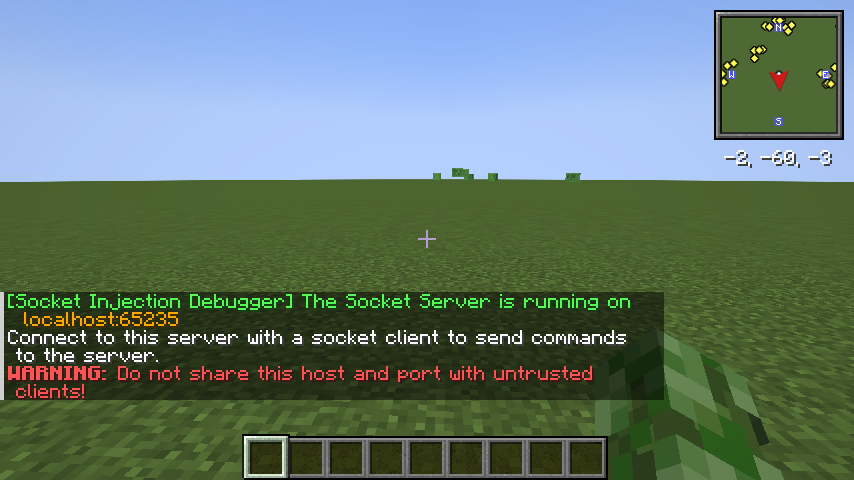
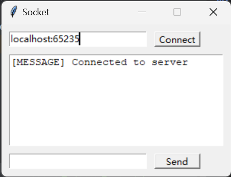
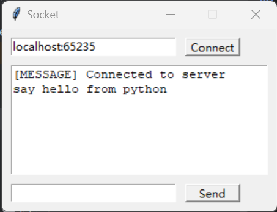
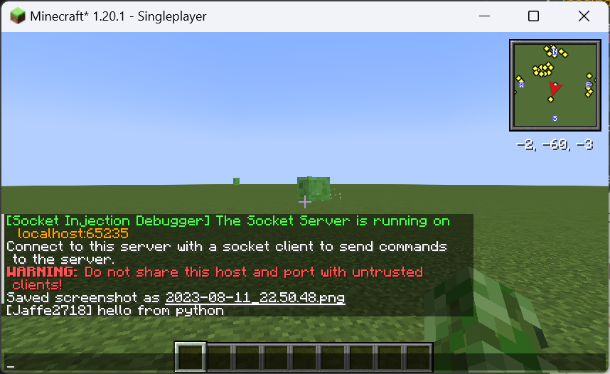
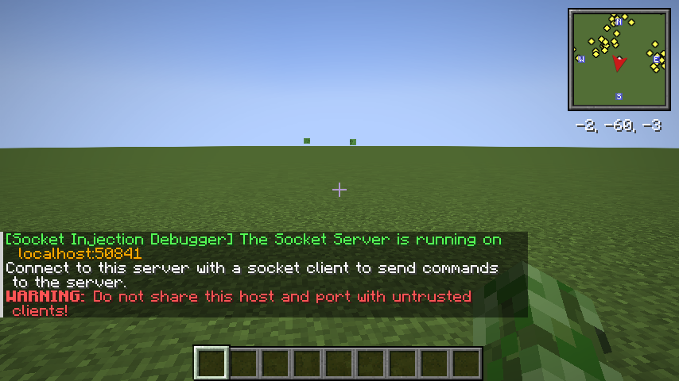
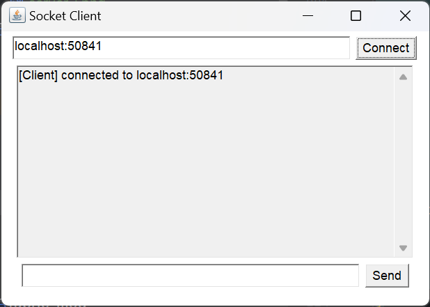
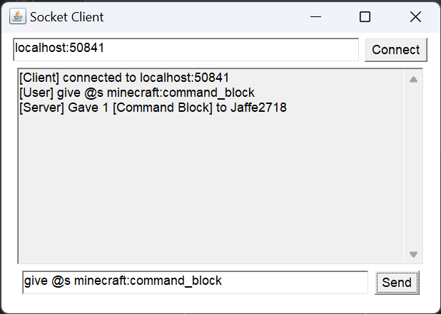
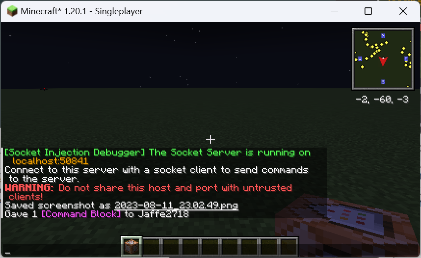

# Socket Injection Debugger


by Jaffe2718

## Introduction
This is a mod that provides a method to execute and debug Minecraft commands by external programs.
It uses socket to communicate with external programs.
When the mod is loaded, it will open a socket server on a random port, then you can connect to it and send commands to it.
The mod will execute the commands and send the result back to the external program once it receives a command from socket client.

For developers, you can make your own program to connect to the socket server and send commands to it.
Or you can develop a plugin for your IDE to make it easier to debug Minecraft commands based on this mod.

## Setup
1. Install Minecraft with Fabric Loader and Fabric API.
2. Download the mod from [GitHub Releases](https://github.com/Jaffe2718/Socket-Injection-Debugger/releases).
3. Put the mod into the `mods` folder and run the game once.

## Usage
1. Run the game and join a world, than the mod will open a socket server on a random port and show it to you in the chat.
2. Use your external program to connect to the socket server.
3. Than you can inject commands to the socket server and the mod will execute the commands and send the result back to you.
4. You can also use the [ide-debug-tool](ide-debug-tool/README.md) to debug Minecraft commands in IDE.
5. If you are developing a external program, you must send a `\n` at the end of the command and encode the command with `utf-8` before sending it to the socket server, otherwise the mod will not execute the command.

## Examples
### Abstract
The programming languages are not important, you can use any language you like to connect to the socket server.
Here I will use Python and Java as examples.
The source code of the examples can be found in the `example` folder.

### Python Example
#### Source code
```python
# socket_inject_client.py
import socket as sk
import tkinter as tk
import threading as td

class App(tk.Tk):

    listen_thread: td.Thread
    sock: sk.socket

    def __init__(self):
        super().__init__()
        self.title('Socket')
        self.geometry('300x200')
        self.resizable(False, False)
        # input host and port
        self.entry_host_port = tk.Entry(self)
        self.entry_host_port.place(x=10, y=10, width=180, height=20)
        # button connect
        self.button_connect = tk.Button(self, text='Connect', command=self.connect)
        self.button_connect.place(x=200, y=10, width=60, height=20)
        # text box
        self.text_box = tk.Text(self)
        self.text_box.place(x=10, y=40, width=280, height=120)
        self.text_box.config(state=tk.DISABLED)
        # socket input entry
        self.entry_socket = tk.Entry(self)
        self.entry_socket.place(x=10, y=170, width=180, height=20)
        # button send
        self.button_send = tk.Button(self, text='Send', command=self.send_to_server)
        self.button_send.place(x=200, y=170, width=60, height=20)

    def connect(self):
        host, port = self.entry_host_port.get().split(':')
        self.sock = sk.socket(sk.AF_INET, sk.SOCK_STREAM)
        self.sock.connect((host, int(port.replace(' ', ''))))
        self.text_box.config(state=tk.NORMAL)
        self.text_box.insert(tk.END, '[MESSAGE] Connected to server\n')
        self.text_box.config(state=tk.DISABLED)
        self.listen_thread = td.Thread(target=self.receive)
        self.listen_thread.start()

    def send_to_server(self):
        data = self.entry_socket.get() + '\n'
        self.sock.send(data.encode())
        self.entry_socket.delete(0, tk.END)
        self.text_box.config(state=tk.NORMAL)
        self.text_box.insert(tk.END, data + '\n')
        self.text_box.config(state=tk.DISABLED)
        self.text_box.see(tk.END)

    def receive(self):
        while True:
            data = self.sock.recv(1024).decode('utf-8')
            self.text_box.config(state=tk.NORMAL)
            self.text_box.insert(tk.END, data + '\n')
            self.text_box.config(state=tk.DISABLED)
            self.text_box.see(tk.END)

if __name__ == '__main__':
    app = App()
    app.mainloop()
    app.sock.shutdown(sk.SHUT_RDWR)
    app.sock.close()
```


#### Steps
1. Launch the game and join a world, then the mod will open a socket server on a random port and show it to you in the chat.

2. Run the Python script and input the host and port of the socket server, then click the `Connect` button. If it shows `[MESSAGE] Connected to server` in the text box, it means the connection is successful.

3. Input the command you want to execute in the socket input entry, then click the `Send` button. The result will be shown in the text box. Here, we try `say hello from python`. We can see the result is `hello from python` in Minecraft.



### Java Example
#### Source code
```java
import java.awt.*;
import java.awt.event.*;
import java.io.*;
import java.net.*;

public class SocketClient extends Frame {

    // input host:port
    TextField hostInput = new TextField(30);
    // connect button
    Button connectBtn = new Button("Connect");
    // msg view
    TextArea msgView = new TextArea(11, 36);
    // msg input
    TextField msgInput = new TextField(30);
    // send button
    Button sendBtn = new Button("Send");

    Socket socket = null;

    public SocketClient() {

        super("Socket Client");
        setLayout(new FlowLayout());

        connectBtn.addActionListener(e -> {
            // connect to socket server
            String host = hostInput.getText();
            if (host.isEmpty()) {
                msgView.append("[Client] Host is empty!\n");
            }
            String[] hostSplit = host.split(":");
            if (hostSplit.length != 2) {
                msgView.append("[Client] Host is invalid!\n");
            }
            String hostName = hostSplit[0];
            int port = Integer.parseInt(hostSplit[1]);
            try {
                this.socket = new Socket(hostName, port);
                msgView.append("[Client] connected to " + host + "\n");
                BufferedReader reader = new BufferedReader(new InputStreamReader(this.socket.getInputStream()));
                Thread recvThread = new Thread(() -> {
                    while (true) {
                        try {
                            String msg;
                            while((msg = reader.readLine()) != null) {
                                msgView.append("[Server] " + msg + "\n");
                            }
                        } catch (IOException ex) {
                            msgView.append("[Client] connection closed! \n");
                        }
                    }
                });
                recvThread.start();
            } catch(IOException ex) {
                msgView.append("[Client] connection failed! \n");
            }
        });
        sendBtn.addActionListener(e -> {
            // send msg to socket server
            if (this.socket == null) {
                msgView.append("[Client] not connected!\n");
            }
            try {
                String msg = msgInput.getText();
                if(!msg.isEmpty()) {
                    PrintWriter writer = new PrintWriter(this.socket.getOutputStream(), true);
                    writer.println(msg);
                    msgView.append("[User] " + msg + "\n");
                }
            } catch(IOException ex) {
                msgView.append("[Client] send error! \n");
            }
        });
        msgView.setEditable(false);
        this.addWindowListener(new WindowAdapter() {
            public void windowClosing(WindowEvent e) {
                try {
                    socket.close();
                } catch (Exception ignored) {
                }
                System.exit(0);
            }
        });
        add(hostInput, BorderLayout.NORTH);
        add(connectBtn, BorderLayout.NORTH);
        add(msgView, BorderLayout.CENTER);
        add(msgInput, BorderLayout.SOUTH);
        add(sendBtn, BorderLayout.SOUTH);
        setSize(425,300);
        setVisible(true);
    }

    public static void main(String[] args) {
        new SocketClient();
    }
}
```

#### Steps
1. Launch the game and join a world, then the mod will open a socket server on a random port and show it to you in the chat.

2. Run the Java program and input the host and port of the socket server, then click the `Connect` button. If it shows `[Client] connected to host:port` in the text box, it means the connection is successful.

3. Input the command you want to execute in the socket input entry, then click the `Send` button. The result will be shown in the text box. Here, we try `give @s minecraft:command_block`. We can see the result is `Given [command_block] * 1 to ****` in Minecraft and the command block is in our inventory.



## Warning
When you use this mod, you should be careful.
Because it can execute any command.
Do not send the host and port to any untusted program to avoid being attacked.
Do not install this mod on your multiplayer server to avoid being attacked by DDOS or other attacks.

## Update and Cooperation
If you have any questions or suggestions, please open an issue or pull request.
Next, I will consider developing a plugin on Jetbrains IDE or VSCode to cooperate with this mod.
Currently, this mod only supports Minecraft 1.20.1 with Fabric, unfortunately, I am not familiar with Forge, NeoForge, Quilt, etc, so I hope someone can help me to port this mod to other platforms.
If you are interested in this, please contact me or give me a pull request.