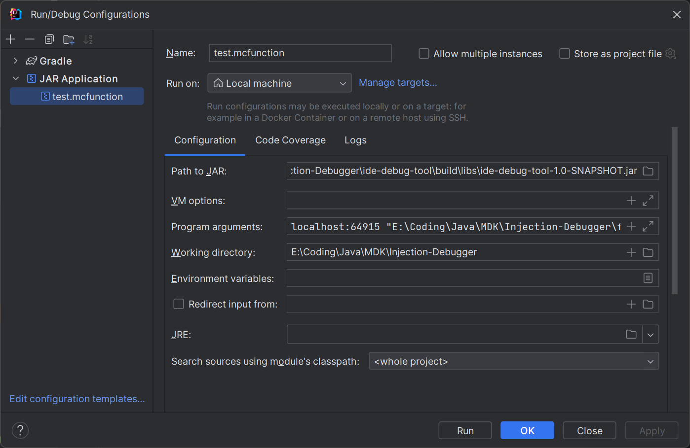
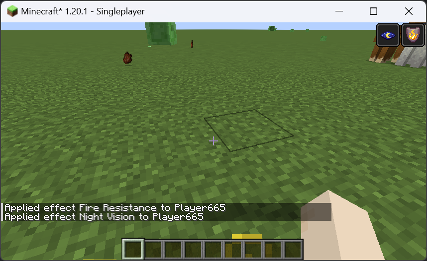

# Socket Injection Debugger (ide-debug-tool) User Documentation

## Introduction
This document describes the usage of the IDE Debug Tool, which is a command line tool that can be used to debug the Socket Injection feature of the IDE. The tool can be used to inject a socket into a running IDE instance, and to send and receive data on the socket.

## Prerequisites
The IDE Debug Tool requires the following:
* A running Minecraft instance with the Socket Injection Debugger mod installed.
* Your IDE or system terminal like PowerShell or CMD (Windows) or Terminal (MacOS/Linux).

## Usage
1. Launch your Minecraft instance with the Socket Injection Debugger mod installed and enter a world, the game will show a message in chat that the Socket Injection Debugger is listening on a port.

2. The usage of the IDE Debug Tool (command line tool) is as follows:
```plaintext
Usage: java -jar ide-debug-tool-[version].jar [host:port] [file]
    no arguments    show usage and exit
    host:port    connect to "host:port" and enter interactive mode
    host:port file    connect to "host:port" and execute the file as Minecraft commands and exit
```
Here is an example of the tool to execute a file in Jetbrains IntelliJ IDEA.
create a file named `test.mcfunction` and write minecraft commands in it, for example:
```mcfunction
effect give @s minecraft:fire_resistance infinite
effect give @s minecraft:night_vision infinite
```
And then create a new `JAR Application` run configuration in IntelliJ IDEA named `test.mcfunction`, 
set the `Path to JAR` to the IDE Debug Tool JAR file, set the `Program arguments` to `localhost:[port] /path/to/test.mcfunction`.

3. Run the `test.mcfunction` run configuration, the IDE Debug Tool will connect to the Minecraft instance and execute the commands in the file.
You can see the output info in your IDE:
```log
D:\Java\jdk-17.0.7\bin\java.exe -Dfile.encoding=UTF-8 -jar E:\Coding\Java\MDK\Injection-Debugger\ide-debug-tool\build\libs\ide-debug-tool-1.0-SNAPSHOT.jar localhost:64915 "E:\Coding\Java\MDK\Injection-Debugger\fabric\run\saves\New World\test.mcfunction"
[Server] Applied effect Fire Resistance to Player665
[Server] Applied effect Night Vision to Player665

Process finished with exit code 0
```
You can also see the result in game:

